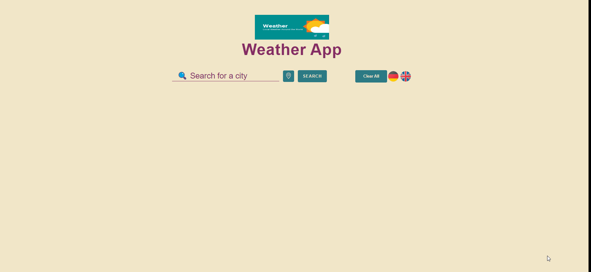

# Weather Condition App

## Description

Project aims to display current weather data of searched city around the world with fetching Weather Api data.

User story;

- User can search city around the world.
- The app can fetch api with the searched city name(... and apikey if it is obligatory).
- User can display weather data of searched city in weather card.
- User can display list of searched city weather data card like on gif.
- If new searched city is in the weather data list, app can display a warning text to user on page.

🔥 You can use [OpenWeather Api](https://openweathermap.org/) for your app.

 <strong> ✠Happy Coding ⌛ </strong> 

